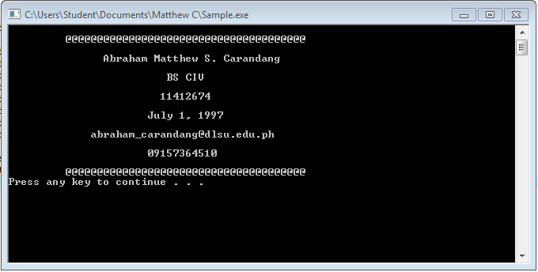

# HelloFromMatthew

Hello world repo!

```
#include <stdio.h>
#include <stdlib.h>


int main() 
{
	printf("\n         @@@@@@@@@@@@@@@@@@@@@@@@@@@@@@@@@@@@@@\n");
	printf("\n               Abraham Matthew S. Carandang\n");
	printf("\n                         BS CIV\n");
	printf("\n                        11412674\n");
	printf("\n                      May 24, 2016\n");
	printf("\n             matthew_carandang@yahoo.com\n");
	printf("\n                      09167364610\n");
	printf("\n         @@@@@@@@@@@@@@@@@@@@@@@@@@@@@@@@@@@@@@\n");
	
	system("PAUSE");
	return 0;
}
```



